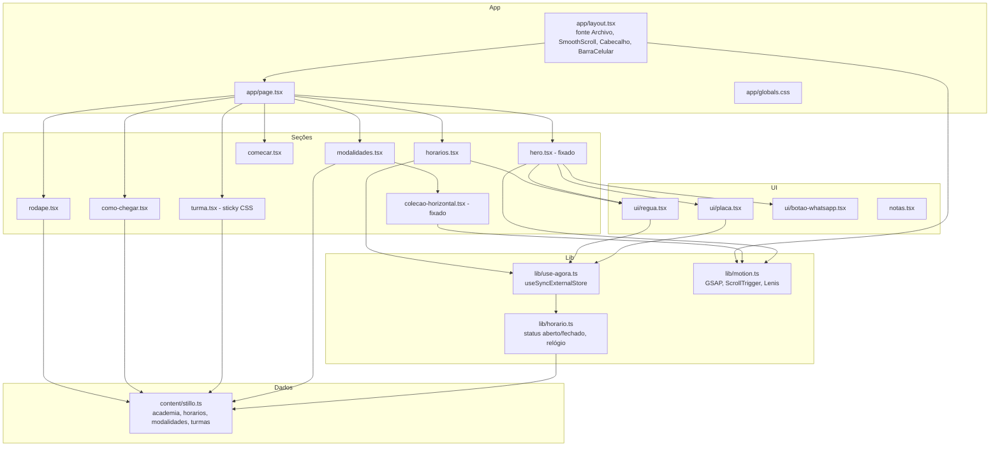
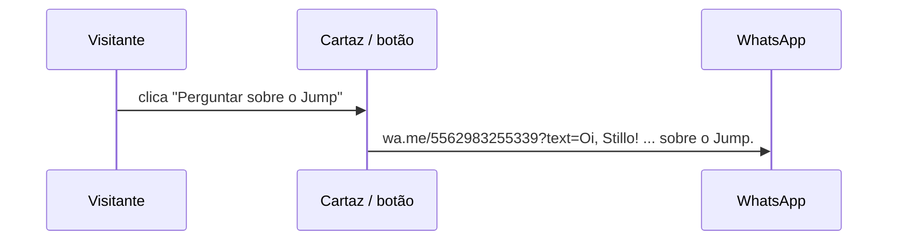

# Codebase Map

> Auto-generated by Cartographer. Last mapped: 2026-09-25T20:03:27Z

Site da Academia Stillo Fitness (Conjunto Vera Cruz I, Goiânia). Rascunho de proposta em Next.js 16 (App Router) + React 19 + TypeScript, com animação de rolagem (GSAP + ScrollTrigger + Lenis) no padrão da skill `site-premium`. Código e comentários em português.

## System Overview



## Directory Structure

```
stillo/
├── app/
│   ├── layout.tsx          # <html>, fonte Archivo (normal + itálico, eixo wdth), metadata, SmoothScroll, Cabecalho, BarraCelular
│   ├── page.tsx            # ordem das seções = ordem dos ScrollTriggers
│   └── globals.css         # tokens (:root), todas as seções, notas, reduced motion
├── components/
│   ├── cabecalho.tsx       # header fixo; fica sólido a partir de #aulas; links com rolarPara
│   ├── barra-celular.tsx   # só ≤760px: status ao vivo + WhatsApp
│   ├── notas.tsx           # <Nota> (post-it) e <NotasToggle> (camada da proposta)
│   ├── motion/             # vindos da referência da skill site-premium
│   │   ├── smooth-scroll.tsx   # Lenis ligado ao ticker do GSAP
│   │   ├── split-chars.tsx     # título em .char > .char__in + cópia .sr-only
│   │   └── contador.tsx        # número que conta ao entrar (pt-BR, sufixo)
│   ├── sections/
│   │   ├── hero.tsx            # letreiro + placa + foto + régua; entrada + pin
│   │   ├── modalidades.tsx     # 8 cartazes + intro + revelação (servidor)
│   │   ├── colecao-horizontal.tsx # trilha horizontal + cortina clip-path (cliente)
│   │   ├── turma.tsx           # coluna sticky + números + mural de polaroides
│   │   ├── horarios.tsx        # semana em réguas, hoje em destaque
│   │   ├── como-chegar.tsx     # referência, endereço, iframe do Google Maps
│   │   ├── comecar.tsx         # 3 passos numerados
│   │   └── rodape.tsx          # "Manda um oi." + grade de contato
│   └── ui/
│       ├── placa.tsx           # placa de porta Aberto/Fechado
│       ├── regua.tsx           # pos(), BarraDia, ReguaDia, textoFaixas
│       ├── botao-whatsapp.tsx  # <a class="botao"> para wa.me com mensagem
│       └── icone-whatsapp.tsx  # SVG
├── content/stillo.ts       # ÚNICA fonte de dados e textos da academia
├── lib/
│   ├── horario.ts          # momentoEm, statusEm, resumoSemana, relógio e simulação
│   ├── use-agora.ts        # hook useAgora()
│   └── motion.ts           # registro do GSAP, Lenis singleton, rolarPara, COM_MOVIMENTO
├── public/fotos/           # logo, turmas, sala-rosa-recorte, ilustracao-equipe (do Instagram)
├── design-plan.md          # identidade visual, dados levantados, revisão contra o briefing
├── README.md               # rodar, apresentação (?notas, ?hora, ?dia), o que é provisório
└── next.config.ts          # CSP e headers de segurança
```

## Module Guide

### Conteúdo (`content/stillo.ts`)
**Purpose**: dados e textos da academia; trocar horário, telefone ou modalidade é só aqui.
**Exports**: `academia` (nome, bairro, instagram, whatsapp, endereco com `mapsUrl`/`rotaUrl`/`embedUrl`), `horarios: Record<DiaSemana, Faixa[]>` (minutos desde 0h, `[abre, fecha)`), `nomesDias`, `modalidades: Modalidade[]` (`id, nome, sobre, formato, descricao, foto?, cor`), `turmas`, `linkWhatsApp(mensagem?)`, `mensagemModalidade(m)`, tipos `DiaSemana`, `Faixa`, `Formato`, `Modalidade`.
**Dependents**: quase tudo. Itens com `// CONFIRMAR` precisam do dono (telefone, endereço).

### Horário ao vivo (`lib/horario.ts`, `lib/use-agora.ts`)
**Purpose**: responder "tá aberto agora?" no fuso `America/Sao_Paulo`, seja qual for o fuso de quem visita.
**Exports**: `momentoEm(date)`, `formatarHora(min)` (360 → "6h", 930 → "15h30"), `faixaAtual`, `statusEm(m)` → `{ aberto, placa, detalhe, frase }`, `resumoSemana()`, `horasAbertasDiaUtil()`, `minutoDaSemanaAgora()`, `momentoDoMinuto()`, `assinarRelogio()`; `useAgora()` → `Momento | null`.
**Regras do `detalhe`**: aberto → "até as 22h" ou "fecha em N min" (≤45 min); fechado → "volta às 15h" (já abriu hoje), "abre às 6h", "abre amanhã às 6h" ou "abre segunda às 6h".

### Movimento (`lib/motion.ts`, `components/motion/*`)
**Purpose**: ponto único do GSAP. Todo componente animado importa `gsap`, `ScrollTrigger`, `useGSAP`, `COM_MOVIMENTO`, `rolarPara` daqui.
`SmoothScroll` cria o Lenis (não cria com reduced motion) e chama `ScrollTrigger.refresh()` após `document.fonts.ready`. `window.ScrollTrigger` é exposto só para o `scripts/prints.mjs` da skill site-premium.

### Seções (`components/sections/*`)
| Arquivo | Cliente? | Padrão | Observação |
|---|---|---|---|
| `hero.tsx` | sim | pin `+=80%`, letreiro se desfaz | única entrada orquestrada da página; placa balança no `pointerenter` |
| `modalidades.tsx` | não | usa `ColecaoHorizontal` | nome do cartaz dimensionado por `--letras` + container query |
| `colecao-horizontal.tsx` | sim | pin + trilha + `clip-path` | `.revelacao` fica `visibility:hidden` até abrir; `focusin` rola até o item focado |
| `turma.tsx` | não | `position: sticky` (CSS) | `Contador` é cliente |
| `horarios.tsx` | sim | estático | usa `useAgora` para "hoje" e "agora" |
| `como-chegar.tsx` | não | estático | `<iframe>` do Google Maps (liberado na CSP) |
| `comecar.tsx` | não | estático | único lugar com numeração (é sequência real) |
| `rodape.tsx` | não | estático | |

### UI e camada de notas
`Placa` (estado em `data-estado="aberto|fechado|carregando"`), `ReguaDia`/`BarraDia` (régua 5h–23h, `pos()` limitado a esse intervalo), `BotaoWhatsApp` (`variante="claro"` para fundo escuro), `Nota`/`NotasToggle` (post-its; `?notas=1` ou botão; `sessionStorage['stillo-notas']`).

## Data Flow

```mermaid
sequenceDiagram
    participant S as Servidor (SSR)
    participant B as Navegador
    participant H as useAgora
    participant L as lib/horario
    S->>B: HTML com placa "Horário" e régua de dia útil (snapshot -1)
    B->>H: hidratação
    H->>L: minutoDaSemanaAgora() (lê ?dia= e ?hora= se houver)
    L-->>H: dia*1440 + minuto (fuso de Goiânia)
    H-->>B: Placa, BarraCelular, ReguaDia, Horarios redesenham
    loop a cada 20 s
        L->>H: assinarRelogio avisa; React só redesenha se o minuto mudou
    end
```



## Conventions

- **Nomes em português** (componentes, props, funções, classes CSS em BEM: `.hero__titulo`, `.cartaz--rosa`).
- **Conteúdo no servidor**: seções recebem dados de `content/stillo.ts`; só o que anima ou depende da hora é `'use client'`.
- **Camadas de animação**: entrada anima o elemento de dentro (`.char__in`, `.hero__onde`, `.placa`, `.hero__foto`), rolagem anima o de fora (`.char`, `*-wrap`). Nunca os dois no mesmo elemento.
- **Reduced motion**: `gsap.matchMedia().add(COM_MOVIMENTO, …)` no JS e `@media (prefers-reduced-motion: reduce)` no CSS (trilha vira rolagem lateral nativa, cortina vira bloco).
- **Failsafe**: `.cabecalho` e as camadas do hero começam `opacity: 0` com `animation: failsafe 0s 4s forwards`; o `useGSAP` mostra antes.
- **Tokens** em `:root` (`--preto`, `--vermelho` #C8102E, `--vermelho-escuro`, `--branco`, `--claro`, `--cinza`, `--display-largura`); cartazes em `cartaz--preto|vermelho|branco`; breakpoints 1100/980/900/760/560/520 px; `--barra-h` vale 68px só no celular. Paleta fechada pelo cliente: nada fora de preto, vermelho e branco.

## Gotchas

- **Ordem dos ScrollTriggers**: hero e coleção são criados na ordem da página. O gatilho do cabeçalho usa `refreshPriority: -1` e `document.getElementById('aulas')` (seletor em string seria restrito ao próprio cabeçalho pelo `scope` do `useGSAP`).
- **Pin dentro de `div` do componente**: `Hero` e `ColecaoHorizontal` embrulham a `<section>` fixada num `div` com `ref`, senão o pin-spacer quebra a desmontagem.
- **Failsafe x GSAP**: a animação CSS `failsafe` com `forwards` vence o estilo inline. Quem usa failsafe e também é animado pela rolagem precisa de `gsap.set(el, { opacity: 1, animation: 'none' })` (feito em `hero.tsx` e `cabecalho.tsx`); sem isso, placa, foto e régua não somem ao rolar.
- **Hero responsivo pela altura**: `.hero` é container de tamanho (`container: hero / size`); em telas baixas a foto some e o título diminui (`@container hero (max-height: ...)`).
- **Hidratação**: nada de hora/data no render do servidor; `useAgora()` retorna `null` no SSR e todos os consumidores têm texto de fallback.
- **Fonte**: só a `Archivo` (eixo `wdth`, itálico). Letreiro = peso 900 + `font-stretch: var(--display-largura)` (66%) + itálico, pela regra agrupada no topo do CSS; horários em `font-stretch: 75%–85%`.
- **CSP**: `style-src 'unsafe-inline'` é necessário (estilos inline de `left`/`--letras`). Nada de CDN: GSAP e Lenis vêm do npm.
- **Porta 3000** costuma estar ocupada por outro projeto na máquina; o README usa 3210.
- **Fotos** são capas de destaque do Instagram (150 px); só servem pequenas.

## Navigation Guide

- **Mudar horário, telefone, endereço, textos dos cartazes**: `content/stillo.ts`.
- **Adicionar uma modalidade**: novo item em `modalidades` (com `sobre` e `cor`) e, se houver, foto em `public/fotos/`.
- **Mudar as regras de "aberto/fechado"**: `lib/horario.ts` (`statusEm`).
- **Adicionar uma seção**: componente em `components/sections/`, incluir em `app/page.tsx` na ordem certa; se for fixada, criar o ScrollTrigger dentro de `useGSAP` com `div` invólucro (máximo de dois trechos fixados na página).
- **Trocar cores/fontes**: `:root` em `app/globals.css` (e a regra agrupada "letreiro") e `next/font` em `app/layout.tsx`.
- **Remover as notas da proposta**: apagar os `<Nota>` das seções, o `<NotasToggle>` do `cabecalho.tsx`, `components/notas.tsx` e o bloco `.nota`/`.notas-botao` do CSS.
- **QA com prints**: `npm run build && npx next start -p 3210`, depois `node <skill site-premium>/scripts/prints.mjs http://localhost:3210 --out prints` (e `--reduce`).
